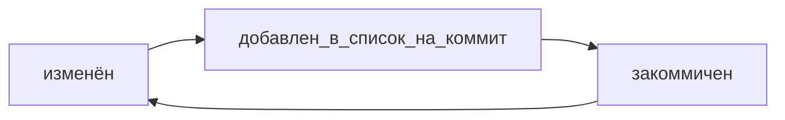

#Шпаргалка Git

Git — это консольный инструмент для работы с локальными и удалёнными репозиториями. Он не связан напрямую ни с одной из платформ и развивается отдельно от них.

<br>

#### Инициализируем репозиторий

Чтобы Git начал отслеживать изменения в проекте, папку с файлами этого проекта нужно сделать Git-репозиторием
```
git init
```

<br>

#### «Разгитить» папку, если что-то пошло не так

Для этого нужно удалить скрытую подпапку .git.

```
rm -rf .git
```
Разберём подробнее, что такое -rf:
- ключ -r (от англ. recursive — «рекурсивно») позволяет удалять папки вместе с их содержимым;
- ключ -f (от англ. force — «заставить») избавит вас от вопросов вроде «Вы точно хотите удалить этот файл? А этот? И этот тоже?».

<br>

#### Проверить состояние репозитория

```
git status
```
##### Статусы untracked/tracked, staged и modified
untracked (англ. «неотслеживаемый»)

- новые файлы в Git-репозитории помечаются как untracked, то есть неотслеживаемые. Git «видит», что такой файл существует, но не следит за изменениями в нём. У untracked-файла нет предыдущих версий, зафиксированных в коммитах или через команду git add.

- staged (англ. «подготовленный»)
После выполнения команды git add файл попадает в staging area (от англ. stage — «сцена», «этап [процесса]» и area — «область»), то есть в список файлов, которые войдут в коммит. В этот момент файл находится в состоянии staged.
💡 Staging area, index и cache
Staging area также называют index (англ. «каталог») или cache (англ. «кеш»), а состояние файла staged иногда называют indexed или cached. Все три варианта могут встречаться в документации и в качестве флагов команд Git. А также в интернете — например, в вопросах и ответах на сайте Stack Overflow.

- tracked (англ. «отслеживаемый»)
Состояние tracked — это противоположность untracked. Оно довольно широкое по смыслу: в него попадают файлы, которые уже были зафиксированы с помощью git commit, а также файлы, которые были добавлены в staging area командой git add. То есть все файлы, в которых Git так или иначе отслеживает изменения.

- modified (англ. «изменённый»)
Состояние modified означает, что Git сравнил содержимое файла с последней сохранённой версией и нашёл отличия. Например, файл был закоммичен и после этого изменён.

Большинство файлов в проектах «шагает» по следующему циклу:



<br>

#### Подготовить файлы к сохранению

```
git add

git add --all # подготовили к сохранению все файлы в репозитории

git add todo.txt # подготовили к сохранению файл todo.txt

git add . # добавить всю текущую папку
```

<br>

#### Просмотреть историю коммитов

```
git log

git log --oneline # получить сокращённый лог

git log -p # история коммитов вместе с их изменением
```

<br>

#### Привязать удалённый репозиторий к локальному

```
git remote add

git remote add origin git@github.com:%ИМЯ_АККАУНТА%/first-project.git
```
- Команде необходимо передать два параметра: имя удалённого репозитория и его URL. В качестве имени используйте слово origin. А URL вы скопировали со страницы удалённого репозитория.
- **origin** (англ. «источник») — стандартный псевдоним, с помощью которого можно обращаться к главному удалённому репозиторию (обычно такой репозиторий один). Это значительно упрощает работу.

<br>

#### Убедиться, что репозитории связаны
```
$ git remote -v

origin    git@github.com:%ИМЯ_АККАУНТА%/%ИМЯ-ПРОЕКТА%.git (fetch)
origin    git@github.com:%ИМЯ_АККАУНТА%/%ИМЯ-ПРОЕКТА%.git (push)
```
Флаг -v — короткая форма флага --verbose (англ. «подробный»). Он позволяет показать больше информации в выводе.

<br>

#### Выполнить коммит

```
git commit -m ‘Мой первый коммит!’

git cammit -a-m '...' # Сразу индексируем и делаем коммит
```

<br>

#### Как исправить последний(HEAD) коммит:
1. **git commit --amend --no-edit**. Благодаря опции **--no-edit** сообщение к коммиту останется таким, каким и было.
2. Изменить сообщение к коммиту позволяет команда **git commit --amend -m "Обновлённое сообщение коммита"**.

<br>

#### Как откатиться назад, если «всё сломалось»:
1. Если проиндексировали все файлы(git add .), но нам необходимо какой-то файл не добавлять в коммит:


```
    git restore --staged <file>
```


2. Иногда нужно «откатить» то, что уже было закоммичено, то есть вернуть состояние репозитория к более раннему.
```
    git reset --hard <commit hash>
```

```
$ git log --oneline # хеш можно найти в истории
7b972f5 (HEAD -> master) style: добавить комментарии, расставить отступы
b576d89 feat: добавить массив Expenses и цикл для добавления трат # вот сюда и вернёмся
4b58962 refactor: разделить analyzeExpenses() на countSum() и saveExpenses()

$ git reset --hard b576d89
# теперь мы на этом коммите
HEAD is now at b576d89 feat: добавить массив Expenses и цикл для добавления трат
```

3. «Откатить» изменения, которые не попали ни в staging, ни в коммит:

```
git restore <file>
```

<br>

#### просмотреть изменения сделанные в определенном коммите

```
git show id_коммита
```

#### Просматриваем изменения в файлах

```
git diff
```

Команда **git diff** сравнит последнюю закоммиченную версию файла с той, что находится в состоянии _modified_.

```
git diff --staged
```

Команда **git diff --staged** покажет изменения в staged-файлах относительно последних закоммиченных версий.


Коротко разберём остальные строки вывода команды:

- Первые две строки (diff --git a/... b/... и index 901da07..ac459e1 100644) — это низкоуровневая техническая информация. Мы не будем на ней останавливаться.
- Строки --- a/teremok.txt и +++ b/teremok.txt говорят, что дальше будет выведен результат сравнения файлов a/teremok.txt и b/teremok.txt — исходной и текущей версий.
- Строка @@ -1,2 +1,2 @@ сообщает, какие строки файла попали в сравнение. Выражение 1,2 (неважно, с плюсом или с минусом) говорит, что были использованы две строки, начиная с первой. Если бы было, например, написано +15,7, это значило бы, что в сравнении участвуют 7 строк, начиная с 15-й.
- Выражение со знаком минус (-1,2) относится к «оригинальной» версии файла (a/teremok.txt), а со знаком плюс (+1,2) — к «изменённой» (b/teremok.txt).

<br>

#### Сравниваем коммиты

```
git diff a9928ab 11bada1 # хеш коммитов

git diff 1c29af6 HEAD
```

<br>

#### Отправить изменения на удалённый репозиторий

```
git push

git push -u origin main # связать локальную ветку с удалённой

git push --set-upstream origin HEAD # связать локальную ветку с удалённой
```
В первый раз эту команду нужно вызвать с флагом -u и параметрами origin (имя удалённого репозитория) и main или master (название текущей ветки). Флаг -u свяжет локальную ветку с одноимённой удалённой.

Флаг --set-upstream — это «полная», или «длинная», версия флага -u. А HEAD здесь — это синоним текущей ветки. С тем же результатом можно было бы выполнить команду git push -u origin feature-goose-poem.

<br>

#### Клонировать репозиторий

```
git clone

git clone git@github.com:.........../git-clone-lesson.git
```

#### Ветки

Ветка (англ. branch) — это изолированный поток разработки проекта. В таком потоке можно проверять разные идеи, тестировать новую функциональность и так далее.

```
git branch # просмотреть список всех веток.

git branch <название_ветки> # создать ветку

git branch -a # покажи все известные ветки, как локальные (в локальном репозитории), так и удалённые (в origin, или на GitHub).

git checkout <название_ветки> # переключиться на другую ветку

git checkout -b <название_ветки> # cоздать ветку и сразу переключиться на неё

git branche -d <название_ветки> # удаляет ветку

git branch -v # Чтобы посмотреть последний коммит на каждой из веток

```

#### Сравнить ветки

```
git diff <название_ветки1> <название_ветки2>
```

#### Суффикс навигации ~

> Git поддерживает суффикс навигации **~**. С его помощью можно сослаться на предыдущие коммиты. Например, если вы находитесь в ветке main и хотите вывести разницу между тем коммитом, который был три коммита назад, и текущим, нужно выполнить git diff main~3 main.

Сравнивать хеши комитов может быть неудобно, ведь в одной ветке их может быть много. Представьте: сначала вы выводите историю через git log, затем ищете в длинном списке хеши тех коммитов, которые хотите сравнить, и только потом выполняете git diff.
Для облегчения этой задачи в Git есть суффикс навигации ~N, где N — это число. Он отсчитывает от заданного коммита N коммитов назад во времени. Нумерация начинается с нуля: commit~0 — это сам коммит, commit~1 — предыдущий, commit~2 — предшествующий предыдущему и так далее.
Например, HEAD~1 — это следующий за текущим коммит. А main~5 — это пятый коммит в ветке main, если считать с последнего выполненного коммита.
На практике чаще нужен либо текущий коммит (HEAD), либо следующий за ним (HEAD~1). Для ~1 есть специальное сокращение ~ (без числа). То есть вместо HEAD~1 обычно пишут просто HEAD~.

```
git diff feature/diff~1 feature/diff

git diff HEAD~5 HEAD

git diff master~3 master~1

git diff 2ea56ab~ 2ea56ab
```

#### Слияние веток
```
git merge <название_ветки>
```
> Перед тем как начать процесс слияния, нужно перейти в ветку, куда должны добавиться изменения. Обычно это главная ветка. Перейдите в неё и вызовите команду git merge с именем присоединяемой ветки feature/diff в качестве параметра.

#### Удалить ветку после объединения

```
git branch -D <название_ветки>
```
> У команды git branch -D есть более безопасный вариант с флагом -d. Он удалит ветку только если она была полностью объединена с другой — то есть если две ветки стали (или изначально были) частью одной истории. Например, если вы нечаянно создали ветку с неправильным названием, её можно удалить через git branch -d %имя_ветки%.

**⚠️ Удаление локальной ветки через Git не удаляет ветку на GitHub!**

#### Отправить локальную ветку в удалённый репозиторий
```
git push

git push -u origin feature/new
```

#### Забрать изменения из удалённого репозитория
```
git pull
```

#### Fast-forward

> Две ветки находятся в состоянии fast-forward, если одну из них можно «перемотать» вперёд и она будет содержать те же коммиты, что и другая. Это утверждение можно сформулировать иначе:
при слиянии этих двух веток никак не возможен конфликт;
истории этих двух веток не «разошлись»;
одна ветка является продолжением другой.

```
$ git checkout main
$ git merge add-docs
Updating 997d9ce..e08fa2a
Fast-forward
 docs.txt | 1 +
 1 file changed, 1 insertion(+)
 create mode 100644 docs.txt

$ git log --oneline
e08fa2a (HEAD -> main, add-docs) New docs 2
fd588b2 New docs 1
997d9ce Commit 4
0313e8e Commit 3
5848aba Commit 2
04923d7 Commit 1
```


**Oтключить fast-forward __--no-ff__**

```
# находимся в ветке main
# --no-edit отключает ввод сообщения для merge-коммита
# --no-ff отключает fast-forward слияние веток
$ git merge --no-edit --no-ff add-docs
Merge made by the 'ort' strategy.
 docs.txt | 1 +
 1 file changed, 1 insertion(+)
 create mode 100644 docs.txt

# с флагом --graph
# Git нарисует ветки с помощью «палочек» и «звёздочек»
# получившийся коммит слияния: 6814789
$ git log --graph --oneline
*   6814789 (HEAD -> main) Merge branch 'add-docs'
|\
| * e08fa2a (add-docs) New docs 2
| * fd588b2 New docs 1
|/
* 997d9ce Commit 4
* 0313e8e Commit 3
* 5848aba Commit 2
* 04923d7 Commit 1
```

>💡 Зачем отключать fast-forward?
Многие проекты отключают fast-forward слияние веток, потому что при нём теряется часть информации. Результат выглядит так, как будто в main «просто появились» новые коммиты. Если не знать о ветке add-docs, то можно подумать, что такой ветки и не было.
Полноценный коммит слияния сохраняет всю информацию: в нём будет указано, какая именно ветка вливалась в main.

#### Non-fast-forward
- При слиянии не-fast-forward веток Git создаёт коммит слияния.

> 💡 Чаще всего сообщения к коммитам слияния не редактируют и оставляют «как предложил Git». Для таких случаев удобен флаг --no-edit: git merge --no-edit %another_branch%.

- При объединении веток в состоянии не-fast-forward возможны (но не обязательны) конфликты. Если конфликты всё же возникли, Git попытается разрешить их самостоятельно или попросит вас сделать это вручную.


#### Rebase
В Git можно решить проблему «разошедшихся» веток с помощью операции rebase (англ. «перебазирование»).


После такого перебазирования ветки будут в состоянииfast-forward, и git push сработает без ошибок. Однако у такого шага могут быть последствия. Например:
- могут возникать конфликты между изменениями, как при слиянии веток;
- если действовать неаккуратно, можно «сломать» репозиторий.

#### git push --force


команда **git push --force** просто «выкинет» (удалит) коммит D и запишет в main@origin коммиты из main.


#### Подходы к работе с ветками
Это правила, которые описывают, когда и для чего создаются ветки, какие в них коммиты и в какой момент происходит слияние веток.
- Feature branch workflow — простой и самый популярный вариант. Если коротко, в нём для каждого нового изменения создаётся новая ветка, которая позже вливается в main с помощью git merge.

- Git flow — более сложный вариант. Подход похож на feature branch workflow, но в нём создаётся больше веток, а изменения (коммиты) делят на разные типы: исправление, новая функциональность и так далее. Разные типы коммитов попадают в разные ветки.
- Trunk-based — популярный в больших компаниях (таких как Яндекс, Google и прочих) подход, который обещает бо́льшую скорость работы в крупных командах.
Этот подход тоже похож на feature branch workflow. Главное отличие в том, что участники проекта вливают (merge) свой код в основную ветку максимально часто. Например, каждый день.
